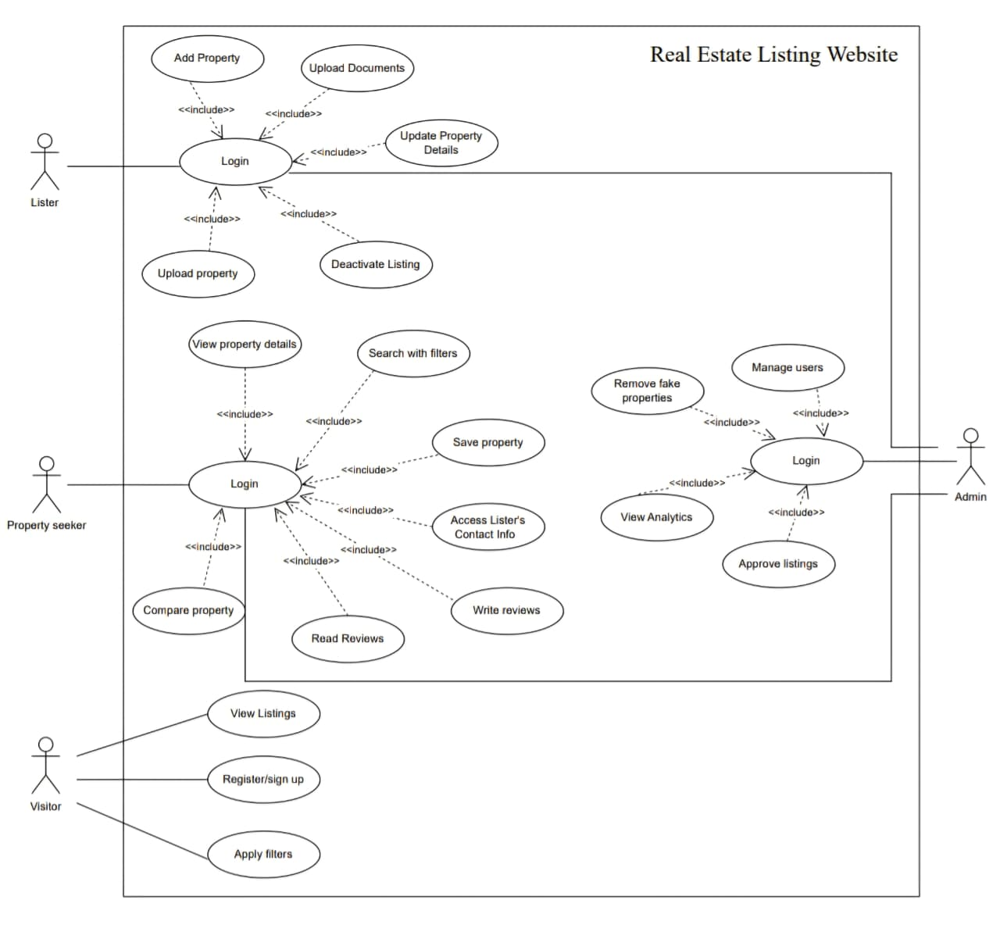

# Real Estate Listing Website

A **real estate listing platform** to support property discovery and connections.  
It is a property information system that maintains information about properties available for sale or rent and facilitates connections between property seekers and verified listers.  

The platform serves as a **comprehensive directory** where property seekers can:  
- Browse detailed property information  
- Schedule visits  
- Connect with property listers  

👉 The platform remains **transaction-neutral** — it does **not** handle payments or financial transactions.  

To ensure accessibility, the system runs on **web browser**, with intuitive navigation and advanced search capabilities.  

---

## Overview of the project

The **Real Estate Listing System (RELS)** is designed for:  
- **Visitors**  
- **Registered users**  
- **Administrators**  

It provides responsive web access across multiple devices, ensuring property information is always available even during peak usage.  
---

## System Goals

1. Provide **management information** that allows administrators to assess:  
   - Platform performance  
   - User engagement  
   - Listing quality against operational targets  

2. Provide **property seekers and listers** with:  
   - Comprehensive property information  
   - Direct communication tools to support informed decisions and connections  

---

## Core Functionality Clarification

The system records and manages:  
- Property details: address, price, type, specifications, images, etc.  
- User interactions: searches, saved listings, comparisons, inquiries  
- Verification status of users and listings  
- Communication requests  

⚠️ The platform **does not**:  
- Process payments  
- Handle deposits  
- Manage financial transactions  

All financial negotiations remain **external** between buyers/renters and listers.  

---

## Key Features

### 1. Property Listing and Discovery
- Listers can create detailed property records with comprehensive data  
- Upload multiple images and documents  
- Manage listing visibility  
- Property seekers can browse, search, filter, and compare properties using advanced criteria (location, price, type, amenities, etc.)  

### 2. Communication Facilitation
- Direct communication via inquiry forms and contact info sharing
- No payment processing or financial features included  

### 3. User Verification and Trust Building
- Verification processes for listers to build trust  
- Transparent review and rating system  
- Document verification ensures authenticity  

### 4. Property Information Management
- Location mapping and neighborhood details  
- Detailed specifications and virtual tours  
- Price history tracking for market insights  

### 5. Administrative Oversight
- User verification and listing moderation  
- Fraud detection and prevention  
- Platform analytics focused on **content quality and user safety**  

---

## Legal and Regulatory Considerations

- **Complies with data protection laws** (privacy of personal information)  
- **Adheres to real estate advertising regulations**  
- Not subject to financial regulations (since no payments are handled)  
- Focuses on:  
  - Accurate property information  
  - User verification  
  - Compliance with local real estate advertising standards  

---

## Critical System Requirements

- **Privacy Protection**: Safeguard user and property data  
- **Fraud Prevention**: Warn users about unverified listings  
- **High Information Accuracy**: Maintain strict verification and moderation standards  
- **Reputation Focus**: Fraudulent listings pose reputational (not financial) risks  

---

## ⚡ Summary

The **RELS platform** is a **trusted, transaction-neutral property information system** that:  
- Helps seekers discover properties  
- Enables communication with listers  
- Provides administrators with oversight tools  
- Ensures compliance with privacy and advertising regulations  

All while maintaining **high standards of trust, security, and usability**.  

# Use Case Diagram

